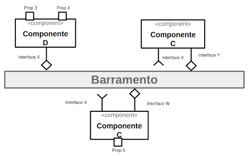

# Template para a Entrega do Projeto Final

# Estrutura de Arquivos e Pastas

A seguir é apresentada a estrutura de pastas esperada para entrega do projeto:

~~~
├── README.md  <- arquivo com o relatório do projeto
│
├── images     <- arquivos de imagens usadas no documento
│
└── resources  <- outros recursos (se houver)
~~~

Na raiz deve haver um arquivo de nome `README.md` contendo a apresentação da equipe e relatório do projeto, como detalhado na seção seguinte.

# Modelo para Apresentação da Equipe e Relatório do Projeto

Segue abaixo o modelo de como devem ser documentadas as entregas. Tudo o que for indicado entre `<...>` indica algo que deve ser substituído pelo indicado.
> Além disso, tudo o que aparecer neste modo de citação também se refere algo que deve ser substituído pelo indicado. No modelo são colocados exemplos ilustrativos, que serão substituídos pelos da sua apresentação.

Para a construção dos diagramas, devem ser usados modelos disponíveis em: [Diagramas de Classes, Interfaces e Componentes]()

# Modelo para Apresentação da Equipe e Relatório do Projeto

# Projeto `<Título>`

# Equipe
* `<nome completo>`

# Nível 1

Apresente aqui o detalhamento do Nível 1 conforme detalhado na especificação com, no mínimo, as seguintes subseções:

## Diagrama Geral do Nível 1

> Apresente um diagrama conforme o modelo a seguir:
>
> 

### Detalhamento da interação de componentes

O detalhamento deve seguir um formato de acordo com o exemplo a seguir:

* Inicia o leilão colocando no barramento a mensagem de tópico “`leilão/início`” (interface `GerenteLeilao`), iniciando um leilão.
* `Componente Y` monitora uma mensagem de tópico “`leilão/início`” pelo barramento (interface ParticipaLeilao) – quando recebe uma mensagem...

Para cada componente será apresentado um documento conforme o modelo a seguir:

## Componente `<Nome do Componente>`

> <Resumo do papel do componente e serviços que ele oferece.>

**Interfaces**
> Listagem das interfaces do componente.

As interfaces listadas são detalhadas a seguir:

## Detalhamento das Interfaces

### Interface `<nome da interface>`

> Resumo do papel da interface.

**Tópico**: `<tópico que a respectiva interface assina ou publica>`

~~~
<Formato da mensagem JSON associada ao objeto enviado/recebido por essa interface.>
~~~

Detalhamento da mensagem JSON:

Atributo | Descrição
-------| --------
`<nome do atributo>` | `<objetivo do atributo>`

